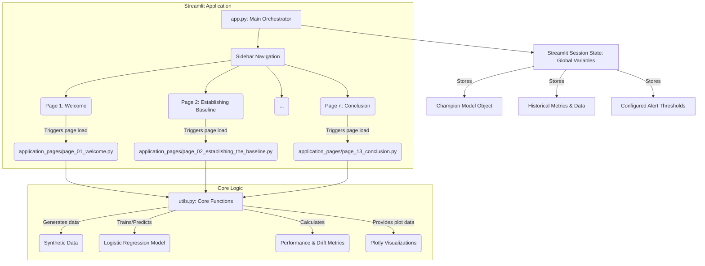
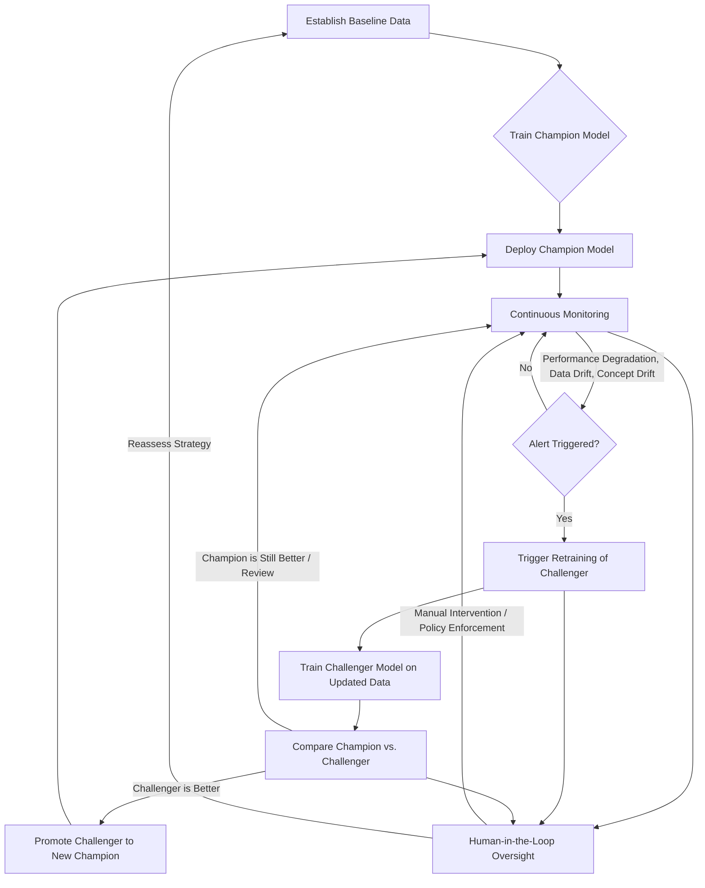

id: 692f416d3bc9bc6a310b84d4_documentation
summary: AI Design and Deployment Lab 4 Documentation
feedback link: https://docs.google.com/forms/d/e/1FAIpQLSfWkOK-in_bMMoHSZfcIvAeO58PAH9wrDqcxnJABHaxiDqhSA/viewform?usp=sf_link
environments: Web
status: Published
# AI Model Risk Management Simulator: A Comprehensive Guide
Duration: 01:30:00

## 1. Introduction: AI Model Risk Management (MRM) and Your Role
Duration: 0:10:00

As a **Risk Manager** in a financial institution, your responsibility extends to ensuring the integrity, reliability, and regulatory compliance of all deployed Artificial Intelligence (AI) models. The dynamic and often unpredictable nature of real-world data means that AI models, once in production, can degrade in performance or become obsolete without proper oversight. This scenario poses significant risks, from financial losses and operational disruptions to reputational damage and regulatory non-compliance (e.g., as outlined in SR 11-7).

This codelab provides a hands-on simulation of a critical AI model's lifecycle in production, focusing on Model Risk Management (MRM) principles. You will learn to:
*   **Establish Baselines:** Define initial model performance and data characteristics.
*   **Monitor Model Health:** Continuously track key performance indicators and data distributions.
*   **Detect Degradation and Drift:** Identify when model performance declines or underlying data changes (data drift, concept drift).
*   **Proactive Intervention:** Configure alert thresholds and trigger retraining of new models.
*   **Evaluate & Govern:** Compare new "Challenger" models against existing "Champions" and make informed deployment decisions, with human oversight.

The application you'll be exploring is built with **Streamlit**, an open-source framework for quickly building data applications. It simulates these MRM challenges and solutions interactively.

### Key Concepts Explained:

*   **Model Risk Management (MRM):** A framework to identify, measure, monitor, and control risks associated with the use of models. Critical in regulated industries like finance (e.g., FRB/OCC SR 11-7).
*   **Champion-Challenger Framework:** A common strategy where a currently deployed "Champion" model is continually tested against new "Challenger" models, with the best performer eventually replacing the Champion.
*   **Performance Degradation:** A decline in a model's predictive accuracy or other performance metrics over time, often due to changes in data or environment.
*   **Data Drift (Covariate Shift):** Occurs when the statistical properties of the input features change over time, making the production data different from the training data.
*   **Concept Drift:** Occurs when the underlying relationship between the input features and the target variable changes over time. This means the "concept" the model learned is no longer valid.
*   **Human-in-the-Loop (HITL):** The practice of involving human judgment and expertise in AI systems, especially for critical decisions, ambiguous situations, or when regulatory compliance requires explicit human validation.

### Application Architecture:

The Streamlit application is structured to be modular and easy to follow:

```
├── app.py                     # Main Streamlit application entry point
├── utils.py                   # Core logic: data generation, model training, metrics, simulation steps
└── application_pages/         # Directory for individual Streamlit pages (steps)
    ├── page_01_welcome.py
    ├── page_02_establishing_the_baseline.py
    ├── ...
    └── page_13_conclusion.py
```

<aside class="positive">
<b>Understanding this architecture is crucial.</b> The `app.py` file handles navigation and global state, while `utils.py` contains the reusable functions for AI model operations, and each `page_XX_*.py` script is a self-contained step in the user journey. This separation of concerns makes the application maintainable and scalable.
</aside>

Let's visualize the high-level architecture of this application:



This diagram illustrates how `app.py` routes user interaction through the sidebar to different `application_pages`. Each page then interacts with `utils.py` for data generation, model training, and metric calculations, and uses Streamlit's `session_state` to maintain persistence across page navigations.

## 2. Setting Up Your Environment
Duration: 0:05:00

To run this Streamlit application locally, you'll first need to set up your Python environment.

### Prerequisites:

*   **Python 3.8+** installed on your system.
*   A code editor (e.g., VS Code).
*   Git (for cloning the repository).

### Step-by-step Setup:

1.  **Clone the Repository (or create the files):**
    If this were a public repository, you would clone it. For this codelab, assume you have the files provided in the prompt. Organize them into the following structure:
    ```
    my_mrm_app/
    ├── app.py
    ├── utils.py
    └── application_pages/
        ├── page_01_welcome.py
        ├── page_02_establishing_the_baseline.py
        ├── page_03_training_the_champion.py
        ├── page_04_reviewing_baseline_performance.py
        ├── page_05_initial_stable_monitoring.py
        ├── page_06_detecting_performance_degradation.py
        ├── page_07_detecting_data_drift.py
        ├── page_08_detecting_concept_drift.py
        ├── page_09_configuring_alert_thresholds.py
        ├── page_10_retraining_a_challenger.py
        ├── page_11_champion_challenger_comparison.py
        ├── page_12_human_in_the_loop_governance.py
        └── page_13_conclusion.py
    ```

2.  **Create a Virtual Environment (Recommended):**
    Navigate to your project directory (`my_mrm_app/`) in your terminal and create a virtual environment:
    ```console
    python -m venv venv
    ```

3.  **Activate the Virtual Environment:**
    *   **On Windows:**
        ```console
        .\venv\Scripts\activate
        ```
    *   **On macOS/Linux:**
        ```console
        source venv/bin/activate
        ```

4.  **Install Dependencies:**
    You'll need `streamlit`, `pandas`, `numpy`, `scikit-learn`, `scipy`, and `plotly`.
    ```console
    pip install streamlit pandas numpy scikit-learn scipy plotly
    ```

5.  **Run the Streamlit Application:**
    From the root of your project directory (`my_mrm_app/`), run:
    ```console
    streamlit run app.py
    ```
    This will open the application in your web browser, typically at `http://localhost:8501`.

<aside class="positive">
Using a virtual environment ensures that the dependencies for this project don't conflict with other Python projects on your machine.
</aside>

## 3. Establishing the Baseline
Duration: 0:05:00

Before deploying any AI model, a fundamental step for a Risk Manager is to **establish a clear baseline**. This involves understanding the initial training data and its statistical properties. This baseline serves as the ground truth against which all future data and model performance will be measured.

In this section, we simulate the generation of a synthetic classification dataset.

### Generating Synthetic Data:

The `utils.py` file contains the `generate_synthetic_classification_data` function, which leverages `sklearn.datasets.make_classification` to create a dataset with specified characteristics and allows for simulating various types of drift.

<details><summary><code>utils.py</code>: <code>generate_synthetic_classification_data</code> snippet</summary>

```python
import streamlit as st
import pandas as pd
import numpy as np
from sklearn.datasets import make_classification
# ... (other imports) ...

def generate_synthetic_classification_data(num_samples=1000, num_features=5, n_informative=3, n_redundant=0, n_clusters_per_class=1, random_state=42, mean_shift=0, std_factor=1, concept_drift_factor=0, performance_degradation_factor=0):
    """
    Generates synthetic classification data with optional drift factors.
    - mean_shift: Shifts the mean of features, simulating data drift.
    - std_factor: Multiplies the standard deviation of features, simulating data drift (increased variance).
    - concept_drift_factor: Changes the underlying relationship between features and target, simulating concept drift.
    - performance_degradation_factor: Directly degrades model performance by flipping some labels.
    """
    X, y = make_classification(
        n_samples=num_samples,
        n_features=num_features,
        n_informative=n_informative,
        n_redundant=n_redundant,
        n_clusters_per_class=n_clusters_per_class,
        random_state=random_state
    )

    # Apply data drift (mean shift and std factor)
    if mean_shift != 0 or std_factor != 1:
        for i in range(X.shape[1]):
            X[:, i] = (X[:, i] * std_factor) + mean_shift

    # Apply concept drift (alter relationship between a feature and target)
    if concept_drift_factor != 0:
        # Example: Flip labels based on a specific feature's value for some samples
        feature_to_drift = 0  # arbitrary choice
        threshold = np.mean(X[:, feature_to_drift])
        drift_indices = np.where(X[:, feature_to_drift] > threshold)[0]
        num_flips = int(len(drift_indices) * concept_drift_factor)
        if num_flips > 0:
            flip_indices_subset = np.random.choice(drift_indices, num_flips, replace=False)
            y[flip_indices_subset] = 1 - y[flip_indices_subset] # Flip the label

    # Apply performance degradation (directly flip labels post-concept drift if any)
    if performance_degradation_factor != 0:
        num_flips = int(num_samples * performance_degradation_factor)
        if num_flips > 0:
            flip_indices = np.random.choice(num_samples, num_flips, replace=False)
            y[flip_indices] = 1 - y[flip_indices]

    return X, y
```
</details>

This function is crucial as it allows us to simulate different real-world scenarios by injecting controlled levels of drift and degradation.

### Page Implementation: `application_pages/page_02_establishing_the_baseline.py`

This page initializes the baseline data and stores it in Streamlit's `session_state`.

<details><summary><code>application_pages/page_02_establishing_the_baseline.py</code> snippet</summary>

```python
import streamlit as st
import pandas as pd
import numpy as np
from utils import generate_synthetic_classification_data

def main():
    st.markdown(
        """
        ## Establishing the Baseline
        ...
        """
    )

    # Initial generation, run once if not in session state
    if 'baseline_X' not in st.session_state:
        st.session_state.baseline_X, st.session_state.baseline_y = generate_synthetic_classification_data(
            num_samples=1000, num_features=5, n_informative=3, n_redundant=0,
            n_clusters_per_class=1, random_state=42
        )
        st.session_state.baseline_df = pd.DataFrame(st.session_state.baseline_X, columns=[f'feature_{i}' for i in range(st.session_state.baseline_X.shape[1])])
        st.session_state.baseline_df['target'] = st.session_state.baseline_y

    st.subheader("Glimpse of Baseline Data")
    st.dataframe(st.session_state.baseline_df.head())
    st.write(f"Baseline Data Shape: {st.session_state.baseline_df.shape}")
    st.write(f"Baseline Target Distribution:\n{st.session_state.baseline_df['target'].value_counts(normalize=True)}")

    st.markdown(
        """
        ...
        """
    )

    if st.button("Proceed to Train the Champion Model"):
        st.session_state.current_page = "Training the Champion"
        st.rerun()
```
</details>

Navigate to the "Establishing the Baseline" page in the Streamlit application. You will see a DataFrame displaying the first few rows of the generated synthetic data, along with its shape and target variable distribution. This confirms that our foundational dataset is ready.

## 4. Training the Champion Model
Duration: 0:05:00

With the baseline data ready, the next step is to train the initial model that will be deployed into production. This model is designated as the **"Champion" model**, representing the current best-performing model.

### Model Training:

The application uses a simple Logistic Regression model for classification. The `train_logistic_regression_model` function in `utils.py` encapsulates this process.

<details><summary><code>utils.py</code>: <code>train_logistic_regression_model</code> snippet</summary>

```python
# ... (imports) ...
from sklearn.linear_model import LogisticRegression

def train_logistic_regression_model(X_train, y_train, random_state=42):
    """Trains a Logistic Regression model."""
    model = LogisticRegression(random_state=random_state, solver='liblinear')
    model.fit(X_train, y_train)
    return model
```
</details>

### Page Implementation: `application_pages/page_03_training_the_champion.py`

This page handles the training of the Champion model using the `baseline_X` and `baseline_y` data stored in `session_state`. It also performs a train-test split to hold out data for evaluating baseline performance.

<details><summary><code>application_pages/page_03_training_the_champion.py</code> snippet</summary>

```python
import streamlit as st
from sklearn.model_selection import train_test_split
from utils import train_logistic_regression_model

def main():
    st.markdown(
        """
        ## Training the Champion Model
        ...
        """
    )

    if 'champion_model' not in st.session_state:
        X_train_baseline, X_test_baseline, y_train_baseline, y_test_baseline = train_test_split(
            st.session_state.baseline_X, st.session_state.baseline_y, test_size=0.3, random_state=42
        )
        st.session_state.champion_model = train_logistic_regression_model(X_train_baseline, y_train_baseline, random_state=42)
        st.session_state.X_test_baseline = X_test_baseline # Store for baseline metrics
        st.session_state.y_test_baseline = y_test_baseline
        st.success("Champion Model trained successfully.")
    else:
        st.info("Champion Model is already trained and ready.")

    st.markdown(
        """
        ...
        """
    )

    if st.button("Review Champion Model's Baseline Performance"):
        st.session_state.current_page = "Reviewing Baseline Performance"
        st.rerun()
```
</details>

Navigate to the "Training the Champion" page. The application will train the Logistic Regression model and store it in `st.session_state.champion_model`. This model is now ready for deployment and monitoring.

## 5. Reviewing Baseline Performance
Duration: 0:10:00

Understanding the Champion model's initial performance is crucial for setting benchmarks. These **baseline metrics** are the standard against which all future performance in production will be compared. Any significant deviation will serve as an early warning sign for potential issues.

### Classification Performance Metrics:

We focus on four key metrics for binary classification:

*   **Accuracy:** The proportion of correctly classified instances.
    $$A = \frac{TP + TN}{TP + TN + FP + FN}$$

*   **Precision:** The proportion of positive identifications that were actually correct. Crucial when false positives are costly.
    $$P = \frac{TP}{TP + FP}$$

*   **Recall (Sensitivity):** The proportion of actual positives that were identified correctly. Important when false negatives are costly.
    $$R = \frac{TP}{TP + FN}$$

*   **F1-Score:** The harmonic mean of Precision and Recall, offering a balanced view, especially with imbalanced classes.
    $$F1 = 2 \times \frac{P \times R}{P + R}$$
    Where: TP (True Positives), TN (True Negatives), FP (False Positives), FN (False Negatives).

The `utils.py` contains `predict_with_model` and `calculate_classification_metrics`.

<details><summary><code>utils.py</code>: Performance Metrics Snippet</summary>

```python
# ... (imports) ...
from sklearn.metrics import accuracy_score, precision_score, recall_score, f1_score

def predict_with_model(model, X_data):
    """Generates predictions from a given model."""
    return model.predict(X_data)

def calculate_classification_metrics(y_true, y_pred):
    """Computes Accuracy, Precision, Recall, F1-Score."""
    metrics = {
        'accuracy': accuracy_score(y_true, y_pred),
        'precision': precision_score(y_true, y_pred, zero_division=0),
        'recall': recall_score(y_true, y_pred, zero_division=0),
        'f1_score': f1_score(y_true, y_pred, zero_division=0)
    }
    return metrics
```
</details>

### Page Implementation: `application_pages/page_04_reviewing_baseline_performance.py`

This page calculates and displays the baseline performance metrics using Streamlit's `st.metric` component.

<details><summary><code>application_pages/page_04_reviewing_baseline_performance.py</code> snippet</summary>

```python
import streamlit as st
from utils import predict_with_model, calculate_classification_metrics

def main():
    st.markdown(
        """
        ## Reviewing Baseline Performance
        ...
        """
    )

    if 'baseline_metrics' not in st.session_state:
        y_pred_baseline = predict_with_model(st.session_state.champion_model, st.session_state.X_test_baseline)
        st.session_state.baseline_metrics = calculate_classification_metrics(st.session_state.y_test_baseline, y_pred_baseline)

    st.subheader("Champion Model Baseline Performance Metrics")
    col1, col2, col3, col4 = st.columns(4)

    with col1:
        st.metric(
            label="Accuracy",
            value=f"{st.session_state.baseline_metrics['accuracy']:.4f}",
            help="..."
        )
    # ... (other metrics) ...

    st.markdown(
        """
        ...
        """
    )

    if st.button("Start Initial Stable Monitoring"):
        st.session_state.current_page = "Initial Stable Monitoring"
        st.rerun()
```
</details>

Visit the "Reviewing Baseline Performance" page. You'll see the calculated metrics displayed prominently. These values are your initial performance benchmarks.

## 6. Initial Stable Monitoring
Duration: 0:10:00

With the Champion model deployed, continuous monitoring is critical. This phase simulates the model operating under **stable, normal conditions** in production. The goal is to observe consistent performance and data distributions, confirming the model's robustness post-deployment.

### The Monitoring Loop: `run_monitoring_step`

The `run_monitoring_step` function in `utils.py` simulates one batch of production data, evaluates the Champion model, calculates performance and data drift metrics, and checks for alerts against predefined thresholds.

<details><summary><code>utils.py</code>: <code>run_monitoring_step</code> snippet</summary>

```python
# ... (imports) ...
def run_monitoring_step(champion_model, historical_data_X_df, historical_data_y_arr, baseline_X, baseline_y, time_step, drift_params, alert_thresholds, num_samples_per_step=100):
    """
    Simulates one batch of production data, calculates metrics, checks for alerts.
    Returns a dictionary of results including new monitoring data and alert status.
    """
    # Generate new batch of data with applied drift
    current_batch_X, current_batch_y = generate_synthetic_classification_data(
        num_samples=num_samples_per_step, num_features=baseline_X.shape[1],
        random_state=42 + time_step, # Vary random state for each step
        mean_shift=drift_params.get('mean_shift', 0),
        std_factor=drift_params.get('std_factor', 1),
        concept_drift_factor=drift_params.get('concept_drift_factor', 0),
        performance_degradation_factor=drift_params.get('performance_degradation_factor', 0)
    )

    current_batch_X_df = pd.DataFrame(current_batch_X, columns=[f'feature_{i}' for i in range(baseline_X.shape[1])])

    # Accumulate monitoring data
    new_monitoring_data_X_df = pd.concat([historical_data_X_df, current_batch_X_df], ignore_index=True)
    new_monitoring_data_y_arr = np.concatenate([historical_data_y_arr, current_batch_y])

    # Evaluate Champion model on the *latest batch* for performance metrics
    y_pred_current_batch = predict_with_model(champion_model, current_batch_X)
    current_performance_metrics = calculate_classification_metrics(current_batch_y, y_pred_current_batch)

    # Calculate data drift for feature_0
    baseline_feature_0 = pd.DataFrame(baseline_X, columns=[f'feature_{i}' for i in range(baseline_X.shape[1])])['feature_0']
    current_feature_0 = current_batch_X_df['feature_0']

    ks_stat_f0, _ = calculate_data_drift_ks(baseline_feature_0, current_feature_0)
    jsd_stat_f0 = calculate_data_drift_jsd(baseline_feature_0, current_feature_0)

    alerts = {}
    if current_performance_metrics['accuracy'] < alert_thresholds['accuracy_min']:
        alerts['accuracy'] = f"Accuracy below threshold: {current_performance_metrics['accuracy']:.4f}"
    if ks_stat_f0 > alert_thresholds['ks_max']:
        alerts['ks_feature_0'] = f"K-S Stat (Feature 0) above threshold: {ks_stat_f0:.4f}"
    if jsd_stat_f0 > alert_thresholds['jsd_max']:
        alerts['jsd_feature_0'] = f"JSD (Feature 0) above threshold: {jsd_stat_f0:.4f}"

    return {
        'time_step': time_step,
        'accuracy': current_performance_metrics['accuracy'],
        'precision': current_performance_metrics['precision'],
        'recall': current_performance_metrics['recall'],
        'f1_score': current_performance_metrics['f1_score'],
        'ks_statistic_feature_0': ks_stat_f0,
        'jsd_statistic_feature_0': jsd_stat_f0,
        'alerts': alerts,
        'monitoring_data_X': new_monitoring_data_X_df,
        'monitoring_data_y': new_monitoring_data_y_arr,
        'drift_params_applied': drift_params.copy()
    }
```
</details>

This function is the heart of the monitoring simulation. It generates new data, makes predictions, calculates metrics, and identifies potential alerts.

### Page Implementation: `application_pages/page_05_initial_stable_monitoring.py`

This page initializes monitoring and runs several `run_monitoring_step` iterations with stable parameters, displaying the results using Plotly charts.

<details><summary><code>application_pages/page_05_initial_stable_monitoring.py</code> snippet</summary>

```python
import streamlit as st
import pandas as pd
import numpy as np
import plotly.graph_objects as go
from utils import run_monitoring_step

def main():
    st.markdown(
        """
        ## Initial Stable Monitoring
        ...
        """
    )

    # Initialize monitoring state if not present
    if 'historical_metrics' not in st.session_state:
        st.session_state.historical_metrics = []
        st.session_state.monitoring_data_X = pd.DataFrame(columns=[f'feature_{i}' for i in range(st.session_state.baseline_X.shape[1])])
        st.session_state.monitoring_data_y = np.array([])
        st.session_state.current_alert_thresholds = {'accuracy_min': 0.85, 'ks_max': 0.15, 'jsd_max': 0.15}
        st.session_state.drift_parameters_stable = {'mean_shift': 0, 'std_factor': 1, 'concept_drift_factor': 0, 'performance_degradation_factor': 0}
        st.session_state.max_time_step_reached = 0
        st.session_state.simulation_logs = {'alerts': []}
        st.session_state.manual_review_log = []
        st.session_state.compare_button_enabled = False
        st.session_state.promote_button_enabled = False

    # Simulate 5 stable steps if not already done
    if st.session_state.max_time_step_reached < 5:
        st.info(f"Simulating initial {5 - st.session_state.max_time_step_reached} stable monitoring steps...")
        for t_step in range(st.session_state.max_time_step_reached + 1, 6):
            step_results = run_monitoring_step(
                st.session_state.champion_model,
                st.session_state.monitoring_data_X,
                st.session_state.monitoring_data_y,
                st.session_state.baseline_X,
                st.session_state.baseline_y,
                t_step,
                st.session_state.drift_parameters_stable, # Stable drift params
                st.session_state.current_alert_thresholds
            )
            st.session_state.historical_metrics.append({
                'time_step': t_step,
                'metrics': {k: v for k,v in step_results.items() if k not in ['alerts', 'monitoring_data_X', 'monitoring_data_y', 'drift_params_applied']},
                'alerts': step_results['alerts'],
                'drift_params_applied': step_results['drift_params_applied']
            })
            st.session_state.monitoring_data_X = step_results['monitoring_data_X']
            st.session_state.monitoring_data_y = step_results['monitoring_data_y']
            st.session_state.max_time_step_reached = t_step
            if step_results['alerts']:
                alert_message = f"ALERT at Time Step {t_step}: {step_results['alerts']}"
                st.session_state.simulation_logs['alerts'].append(alert_message)
                st.warning(alert_message)
        st.success(f"Completed {st.session_state.max_time_step_reached} stable monitoring steps.")
    # ... (Plotting code) ...
```
</details>

Navigate to "Initial Stable Monitoring". You'll see two interactive Plotly charts:
*   **Model Performance Metrics Over Time:** Displays accuracy, precision, recall, and F1-score.
*   **Data Drift Metrics Over Time (Feature 0):** Tracks Kolmogorov-Smirnov (K-S) and Jensen-Shannon Divergence (JSD) for a specific feature.

During this stable phase, all metrics should remain consistent and above/below their respective alert thresholds.

## 7. Detecting Performance Degradation
Duration: 0:10:00

In the real world, models don't always maintain optimal performance. This section simulates **performance degradation**, where the Champion model's effectiveness starts to decline. This could be due to external factors, subtle data issues, or changes in customer behavior not yet captured as explicit data drift.

### Simulating Degradation:

The `generate_synthetic_classification_data` function in `utils.py` uses the `performance_degradation_factor` to directly flip labels in the generated data, simulating a drop in model performance.

### Page Implementation: `application_pages/page_06_detecting_performance_degradation.py`

This page continues the monitoring simulation, but now with a gradually increasing `performance_degradation_factor` applied to the incoming data batches.

<details><summary><code>application_pages/page_06_detecting_performance_degradation.py</code> snippet</summary>

```python
import streamlit as st
# ... (imports) ...
from utils import run_monitoring_step

def main():
    st.markdown(
        """
        ## Detecting Performance Degradation
        ...
        """
    )

    # Continue simulation with performance degradation for steps 6-15
    if st.session_state.max_time_step_reached < 15:
        st.info(f"Simulating performance degradation for the next {15 - st.session_state.max_time_step_reached} monitoring steps...")
        for t_step in range(max(6, st.session_state.max_time_step_reached + 1), 16):
            current_drift_params = st.session_state.drift_parameters_stable.copy()
            current_drift_params['performance_degradation_factor'] = min(0.01 * (t_step - 5), 0.15) # Gradually degrade performance
            
            step_results = run_monitoring_step(
                st.session_state.champion_model,
                st.session_state.monitoring_data_X,
                st.session_state.monitoring_data_y,
                st.session_state.baseline_X,
                st.session_state.baseline_y,
                t_step,
                current_drift_params,
                st.session_state.current_alert_thresholds
            )
            st.session_state.historical_metrics.append({
                'time_step': t_step,
                'metrics': {k: v for k,v in step_results.items() if k not in ['alerts', 'monitoring_data_X', 'monitoring_data_y', 'drift_params_applied']},
                'alerts': step_results['alerts'],
                'drift_params_applied': step_results['drift_params_applied']
            })
            st.session_state.monitoring_data_X = step_results['monitoring_data_X']
            st.session_state.monitoring_data_y = step_results['monitoring_data_y']
            st.session_state.max_time_step_reached = t_step
            if step_results['alerts']:
                alert_message = f"ALERT at Time Step {t_step}: {step_results['alerts']}"
                st.session_state.simulation_logs['alerts'].append(alert_message)
                st.warning(alert_message)
        st.success(f"Completed monitoring steps up to {st.session_state.max_time_step_reached}, observing performance degradation.")
    # ... (Plotting code) ...
```
</details>

Navigate to "Detecting Performance Degradation". Observe the "Model Performance Metrics Over Time" chart. You should see a noticeable decline in metrics like Accuracy, potentially crossing the red threshold line and triggering alerts. The data drift metrics, however, should remain relatively stable as the degradation is directly applied to labels, not input features initially.

## 8. Understanding and Detecting Data Drift (Covariate Shift)
Duration: 0:15:00

**Data drift (or covariate shift)** is a critical challenge in AI monitoring. It refers to the phenomenon where the statistical properties of the input features to a model change over time. This means the data the model receives in production differs from the data it was trained on, which can severely impact performance even if the underlying relationship between features and target remains valid.

### Data Drift Metrics:

We use two statistical tests to quantify data drift:

*   **Kolmogorov-Smirnov (K-S) Statistic:** Measures the maximum difference between the cumulative distribution functions (CDFs) of two samples. A higher K-S statistic indicates greater dissimilarity between the baseline and current data distributions.
    $$D_{n,m} = \sup_x |F_{1,n}(x) - F_{2,m}(x)|$$
    Where $F_{1,n}(x)$ and $F_{2,m}(x)$ are the empirical distribution functions for the two samples.

*   **Jensen-Shannon Divergence (JSD):** A symmetric and smoothed version of Kullback-Leibler (KL) Divergence. It measures the similarity between two probability distributions. A higher JSD value indicates greater divergence.
    $$\text{JSD}(P||Q) = \frac{1}{2} D_{\text{KL}}(P||M) + \frac{1}{2} D_{\text{KL}}(Q||M)$$
    Where $M = \frac{1}{2}(P+Q)$, and $D_{\text{KL}}(P||Q) = \sum_i P(i) \log\left(\frac{P(i)}{Q(i)}\right)$ is the Kullback-Leibler Divergence.

<details><summary><code>utils.py</code>: Data Drift Metrics Snippet</summary>

```python
# ... (imports) ...
from scipy.stats import ks_2samp
from scipy.special import rel_entr

def calculate_data_drift_ks(baseline_feature_data, current_feature_data):
    """Calculates the Kolmogorov-Smirnov (K-S) statistic."""
    if len(baseline_feature_data) == 0 or len(current_feature_data) == 0:
        return 0.0, 1.0 # Return 0 for statistic, 1 for p-value if data is empty
    ks_stat, p_value = ks_2samp(baseline_feature_data, current_feature_data)
    return ks_stat, p_value

def _kl_divergence(p, q):
    """Calculates KL divergence for two probability distributions."""
    return np.sum(rel_entr(p, q))

def calculate_data_drift_jsd(baseline_feature_data, current_feature_data, num_bins=50):
    """Calculates Jensen-Shannon Divergence (JSD)."""
    if len(baseline_feature_data) == 0 or len(current_feature_data) == 0:
        return 0.0

    # Determine common bins for both distributions
    all_data = np.concatenate([baseline_feature_data, current_feature_data])
    min_val, max_val = all_data.min(), all_data.max()
    bins = np.linspace(min_val, max_val, num_bins + 1)

    # Get histograms (counts) and normalize to probabilities
    hist_baseline, _ = np.histogram(baseline_feature_data, bins=bins, density=True)
    hist_current, _ = np.histogram(current_feature_data, bins=bins, density=True)

    # Add a small epsilon to avoid log(0) if any bin is empty
    epsilon = 1e-10
    p = hist_baseline + epsilon
    q = hist_current + epsilon

    # Calculate M = 0.5 * (P + Q)
    m = 0.5 * (p + q)

    # Calculate JSD
    jsd = 0.5 * (_kl_divergence(p, m) + _kl_divergence(q, m))
    return np.sqrt(jsd) # Often reported as square root of JSD
```
</details>

### Simulating Data Drift:

The `generate_synthetic_classification_data` function uses `mean_shift` and `std_factor` parameters to alter the distribution of features, simulating data drift.

### Page Implementation: `application_pages/page_07_detecting_data_drift.py`

This page demonstrates data drift by applying a `mean_shift` to `feature_0` in subsequent monitoring steps. It also includes an example to show how K-S and JSD values react to drift and visualizes the distribution shift with overlaid histograms.

<details><summary><code>application_pages/page_07_detecting_data_drift.py</code> snippet</summary>

```python
import streamlit as st
# ... (imports) ...
from utils import run_monitoring_step, calculate_data_drift_ks, calculate_data_drift_jsd

def main():
    st.markdown(
        """
        ## Understanding and Detecting Data Drift (Covariate Shift)
        ...
        """
    )

    st.subheader("Example: Demonstrating K-S and JSD")
    # ... (example code) ...

    # Simulate steps 16-30 with data drift (mean shift), reset other drifts
    if st.session_state.max_time_step_reached < 30:
        st.info(f"Simulating data drift for the next {30 - st.session_state.max_time_step_reached} monitoring steps (Time Steps {st.session_state.max_time_step_reached + 1}-{30})...")
        for t_step in range(max(16, st.session_state.max_time_step_reached + 1), 31):
            current_drift_params = st.session_state.drift_parameters_stable.copy() # Start from stable
            current_drift_params['mean_shift'] = min(0.1 * (t_step - 15), 1.0) # Gradually shift mean for feature 0
            # Ensure other drift factors are reset for this specific scenario demonstration
            current_drift_params['performance_degradation_factor'] = 0
            current_drift_params['concept_drift_factor'] = 0

            step_results = run_monitoring_step(
                st.session_state.champion_model,
                st.session_state.monitoring_data_X,
                st.session_state.monitoring_data_y,
                st.session_state.baseline_X,
                st.session_state.baseline_y,
                t_step,
                current_drift_params,
                st.session_state.current_alert_thresholds
            )
            # ... (store results) ...
    # ... (Plotting and visualization code) ...
```
</details>

Navigate to "Detecting Data Drift". Observe the "Data Drift Metrics Over Time (Feature 0)" chart. You will see a clear increase in both K-S Statistic and JSD, likely crossing their respective thresholds. The overlaid histograms for `feature_0` will visually confirm the shift in its distribution from the baseline. This is a clear signal of data drift.

## 9. Understanding and Detecting Concept Drift
Duration: 0:15:00

Beyond changes in input data distribution, **concept drift** occurs when the fundamental relationship between the input features and the target variable changes over time. This means the "rules" the model learned during training are no longer valid, even if the input data distributions might seem stable. Concept drift often leads to significant model performance degradation.

### Simulating Concept Drift:

The `generate_synthetic_classification_data` function uses the `concept_drift_factor` to flip labels based on a specific feature's value for some samples, effectively changing the underlying decision boundary.

### Page Implementation: `application_pages/page_08_detecting_concept_drift.py`

This page simulates concept drift by gradually introducing the `concept_drift_factor` in the data generation process.

<details><summary><code>application_pages/page_08_detecting_concept_drift.py</code> snippet</summary>

```python
import streamlit as st
# ... (imports) ...
from utils import run_monitoring_step

def main():
    st.markdown(
        """
        ## Understanding and Detecting Concept Drift
        ...
        """
    )

    # Simulate steps 31-45 with concept drift, resetting other drifts for a focused demonstration
    if st.session_state.max_time_step_reached < 45:
        st.info(f"Simulating concept drift for the next {45 - st.session_state.max_time_step_reached} monitoring steps (Time Steps {st.session_state.max_time_step_reached + 1}-{45})...")
        for t_step in range(max(31, st.session_state.max_time_step_reached + 1), 46):
            current_drift_params = st.session_state.drift_parameters_stable.copy() # Start from stable base
            current_drift_params['concept_drift_factor'] = min(0.01 * (t_step - 30), 0.1) # Gradually introduce concept drift
            # Ensure other drift factors are reset for this specific scenario demonstration
            current_drift_params['mean_shift'] = 0
            current_drift_params['performance_degradation_factor'] = 0

            step_results = run_monitoring_step(
                st.session_state.champion_model,
                st.session_state.monitoring_data_X,
                st.session_state.monitoring_data_y,
                st.session_state.baseline_X,
                st.session_state.baseline_y,
                t_step,
                current_drift_params,
                st.session_state.current_alert_thresholds
            )
            # ... (store results) ...
    # ... (Plotting code) ...
```
</details>

Navigate to "Detecting Concept Drift". Focus on the "Model Performance Metrics Over Time" chart. You should observe a significant decline in model performance. Crucially, examine the "Data Drift Metrics Over Time (Feature 0)" chart; in this isolated scenario, the K-S and JSD statistics for `feature_0` should remain relatively stable, highlighting that the problem is not in the input data distribution itself, but in how it relates to the target. This distinction is vital for root cause analysis.

## 10. Configuring Alert Thresholds
Duration: 0:10:00

Proactive risk management relies on well-defined **alert thresholds**. These thresholds are critical control points that translate an organization's risk appetite into actionable monitoring alerts. Setting them correctly ensures that significant issues are flagged without generating excessive "noise" (false positives).

### Dynamic Threshold Adjustment:

This page allows you to interactively adjust the alert thresholds for accuracy, K-S statistic, and JSD. As you change these values, the application re-evaluates all historical monitoring data, demonstrating how different thresholds would have triggered alerts at various time steps.

### Page Implementation: `application_pages/page_09_configuring_alert_thresholds.py`

This page uses Streamlit sliders to allow dynamic adjustment of thresholds. The `update_alert_thresholds` function recalculates which historical steps would have triggered alerts based on the new settings and updates the plots accordingly.

<details><summary><code>application_pages/page_09_configuring_alert_thresholds.py</code> snippet</summary>

```python
import streamlit as st
# ... (imports) ...

def update_alert_thresholds():
    # This function is called when slider values change
    st.session_state.current_alert_thresholds['accuracy_min'] = st.session_state.accuracy_threshold_slider
    st.session_state.current_alert_thresholds['ks_max'] = st.session_state.ks_threshold_slider
    st.session_state.current_alert_thresholds['jsd_max'] = st.session_state.jsd_threshold_slider

    # Re-evaluate all historical_metrics with new thresholds
    updated_alerts_log = []
    for i, step_data in enumerate(st.session_state.historical_metrics):
        re_evaluated_alerts = {}
        current_metrics = step_data['metrics']
        time_step = step_data['time_step']

        if current_metrics['accuracy'] < st.session_state.current_alert_thresholds['accuracy_min']:
            re_evaluated_alerts['accuracy'] = f"Accuracy ({current_metrics['accuracy']:.4f}) below threshold ({st.session_state.current_alert_thresholds['accuracy_min']:.4f})."
        # ... (other alert checks) ...
        
        st.session_state.historical_metrics[i]['alerts'] = re_evaluated_alerts
        if re_evaluated_alerts:
            alert_details_str = ", ".join(re_evaluated_alerts.values())
            updated_alerts_log.append(f"ALERT at Time Step {time_step}: {alert_details_str}")
    
    st.session_state.simulation_logs['alerts'] = updated_alerts_log # Update log for display
    st.rerun() # Rerun to re-render plots with new thresholds and highlighted alerts

def main():
    st.markdown(
        """
        ## Configuring Alert Thresholds
        ...
        """
    )

    st.subheader("Adjust Alert Thresholds")

    # Sliders for threshold adjustment
    st.slider(
        label=r"Min. Accuracy Threshold $\Delta A_{min}$",
        min_value=0.0,
        max_value=1.0,
        value=st.session_state.current_alert_thresholds['accuracy_min'],
        step=0.01,
        key="accuracy_threshold_slider",
        on_change=update_alert_thresholds,
        help="..."
    )
    # ... (other sliders) ...

    # ... (Plotting code with alert markers) ...
    st.subheader("Alert Log")
    st.text_area("Alert Events Log", value="\n".join(st.session_state.simulation_logs['alerts']), height=200, disabled=True)

    st.markdown(
        """
        ...
        """
    )

    if st.button("Proceed to Retrain a Challenger Model"):
        st.session_state.current_page = "Retraining a Challenger"
        st.rerun()
```
</details>

Navigate to "Configuring Alert Thresholds". Experiment with the sliders. Notice how the dashed alert lines on the charts move, and how "X" markers appear or disappear, indicating when alerts would have been triggered. The "Alert Log" at the bottom also updates dynamically. This interactive experience highlights the importance of setting appropriate risk tolerance.

## 11. Simulating Interventions: Retraining a "Challenger" Model
Duration: 0:08:00

When alerts indicate that the Champion model is no longer performing adequately due to degradation or drift, a common intervention is to **retrain a new "Challenger" model**. This new model is typically trained on a more up-to-date dataset, including the recent production data that caused the Champion's issues.

### Retraining the Challenger:

The `retrain_challenger_model` function in `utils.py` trains a new Logistic Regression model. In this simulation, the Challenger is trained on the combined baseline data and all accumulated monitoring data, allowing it to adapt to the observed changes.

<details><summary><code>utils.py</code>: <code>retrain_challenger_model</code> snippet</summary>

```python
# ... (imports) ...
def retrain_challenger_model(X_train_challenger, y_train_challenger, random_state=42):
    """Trains a new Challenger model."""
    model = LogisticRegression(random_state=random_state, solver='liblinear')
    model.fit(X_train_challenger, y_train_challenger)
    return model
```
</details>

### Page Implementation: `application_pages/page_10_retraining_a_challenger.py`

This page orchestrates the retraining process for the Challenger model and then evaluates its immediate performance on the most recent batch of monitoring data.

<details><summary><code>application_pages/page_10_retraining_a_challenger.py</code> snippet</summary>

```python
import streamlit as st
# ... (imports) ...
from utils import retrain_challenger_model, predict_with_model, calculate_classification_metrics

def on_retrain_clicked():
    st.info("Simulating model retraining...")
    
    # Combine baseline data with all accumulated monitoring data for challenger training
    challenger_X_train = pd.concat([
        pd.DataFrame(st.session_state.baseline_X, columns=[f'feature_{i}' for i in range(st.session_state.baseline_X.shape[1])]),
        st.session_state.monitoring_data_X
    ], ignore_index=True)
    challenger_y_train = np.concatenate([st.session_state.baseline_y, st.session_state.monitoring_data_y])
    
    st.session_state.challenger_model = retrain_challenger_model(challenger_X_train, challenger_y_train, random_state=42)
    st.success("Challenger Model trained successfully.")
    
    # Evaluate Challenger's performance on the *most recent* monitoring data
    # ... (evaluation logic) ...

    st.session_state.compare_button_enabled = True # Enable next button
    st.rerun()

def main():
    st.markdown(
        """
        ## Simulating Interventions: Retraining a "Challenger" Model
        ...
        """
    )

    if st.button("Simulate Retraining Challenger Model", on_click=on_retrain_clicked):
        pass # The action is handled by on_retrain_clicked

    if 'challenger_model' in st.session_state and st.session_state.challenger_model is not None:
        st.success("Challenger Model has been trained. You can now compare it with the Champion.")
        if st.session_state.compare_button_enabled:
            if st.button("Proceed to Champion-Challenger Comparison"):
                st.session_state.current_page = "Champion-Challenger Comparison"
                st.rerun()
    else:
        st.info("Click the button above to train a new Challenger model.")
```
</details>

Navigate to "Retraining a Challenger". Click the "Simulate Retraining Challenger Model" button. The application will train a new model. After training, you'll see its performance metrics on recent data, giving an initial indication of its potential effectiveness.

## 12. Champion-Challenger Comparison and Model Promotion
Duration: 0:10:00

After training a Challenger model, a crucial decision point arises: should it replace the current Champion? This requires a rigorous, **data-driven comparison** to ensure the new model truly offers a significant improvement and mitigates the previously identified risks.

### Comparison Logic: `compare_champion_challenger`

The `compare_champion_challenger` function in `utils.py` generates Plotly bar charts comparing the performance and drift metrics of both the Champion and Challenger models on the same, most recent monitoring data.

<details><summary><code>utils.py</code>: <code>compare_champion_challenger</code> snippet</summary>

```python
# ... (imports) ...
import plotly.graph_objects as go

def compare_champion_challenger(champion_metrics, challenger_metrics, champion_drift_metrics, challenger_drift_metrics):
    """
    Generates plotly bar charts for model performance and drift comparison.
    Expects champion_drift_metrics and challenger_drift_metrics to contain
    performance and drift metrics for consistent plotting.
    """
    # Performance Metrics Comparison
    metrics_to_compare = ['accuracy', 'precision', 'recall', 'f1_score']
    perf_data = []
    for metric in metrics_to_compare:
        perf_data.append({'Metric': metric, 'Model': 'Champion', 'Score': champion_metrics.get(metric, 0.0)})
        perf_data.append({'Metric': metric, 'Model': 'Challenger', 'Score': challenger_metrics.get(metric, 0.0)})
    perf_df = pd.DataFrame(perf_data)

    fig_perf_comp = go.Figure()
    # ... (plotting code) ...

    # Drift Metrics Comparison
    drift_metrics_to_compare = ['ks_statistic_feature_0', 'jsd_statistic_feature_0']
    drift_data = []
    for metric_key in drift_metrics_to_compare:
        drift_data.append({'Metric': metric_key.replace("_", " ").title(), 'Model': 'Champion', 'Statistic': champion_drift_metrics.get(metric_key, 0.0)})
        drift_data.append({'Metric': metric_key.replace("_", " ").title(), 'Model': 'Challenger', 'Statistic': challenger_drift_metrics.get(metric_key, 0.0)})
    drift_df = pd.DataFrame(drift_data)

    fig_drift_comp = go.Figure()
    # ... (plotting code) ...

    return fig_perf_comp, fig_drift_comp
```
</details>

### Page Implementation: `application_pages/page_11_champion_challenger_comparison.py`

This page allows you to trigger the comparison and, if satisfied, promote the Challenger model to become the new Champion.

<details><summary><code>application_pages/page_11_champion_challenger_comparison.py</code> snippet</summary>

```python
import streamlit as st
# ... (imports) ...
from utils import predict_with_model, calculate_classification_metrics, calculate_data_drift_ks, calculate_data_drift_jsd, compare_champion_challenger

def on_compare_clicked():
    if st.session_state.challenger_model is None:
        st.warning("Please train the Challenger Model first on the previous page.")
        return

    st.info("Comparing Champion and Challenger models...")

    # Use the entire accumulated monitoring data for a comprehensive comparison
    current_monitoring_X = st.session_state.monitoring_data_X.to_numpy()
    current_monitoring_y = st.session_state.monitoring_data_y

    # ... (evaluate champion and challenger) ...
    # ... (calculate drift metrics) ...

    fig_perf_comp, fig_drift_comp = compare_champion_challenger(champion_metrics_recent, challenger_metrics_recent, champion_all_metrics, challenger_all_metrics)

    st.session_state.fig_perf_comp = fig_perf_comp
    st.session_state.fig_drift_comp = fig_drift_comp
    st.session_state.compare_results_displayed = True
    st.session_state.promote_button_enabled = True # Enable the promote button after comparison
    st.success("Comparison complete. Review the results below.")
    st.rerun()

def on_promote_clicked():
    if st.session_state.challenger_model is not None:
        st.session_state.champion_model = st.session_state.challenger_model
        st.session_state.champion_model_name = "Challenger Model (Promoted)" # Update sidebar status
        st.success("Challenger Model successfully promoted to become the new Champion!")
        st.info("Monitoring will now continue with the new Champion model. Historical monitoring data has been reset to reflect a fresh start.")
        
        # Reset relevant session state for a new monitoring cycle with the new champion
        st.session_state.challenger_model = None
        st.session_state.historical_metrics = []
        st.session_state.monitoring_data_X = pd.DataFrame(columns=[f'feature_{i}' for i in range(st.session_state.baseline_X.shape[1])])
        st.session_state.monitoring_data_y = np.array([])
        st.session_state.max_time_step_reached = 0
        st.session_state.simulation_logs['alerts'] = []
        st.session_state.compare_button_enabled = False
        st.session_state.promote_button_enabled = False
        st.session_state.compare_results_displayed = False

        st.session_state.current_page = "Initial Stable Monitoring" # Go back to stable monitoring with new champion
        st.rerun()
    else:
        st.warning("No Challenger model available to promote.")

def main():
    st.markdown(
        """
        ## Champion-Challenger Comparison and Model Promotion
        ...
        """
    )

    if st.session_state.get('challenger_model') is None:
        st.warning("Please train the Challenger Model on the 'Retraining a Challenger' page first to proceed with the comparison.")
        return

    st.button("Compare Champion vs. Challenger", on_click=on_compare_clicked, disabled=not st.session_state.get('compare_button_enabled', False))

    if st.session_state.get('compare_results_displayed', False):
        st.markdown("\nAnalysis: Observe how the Challenger model performs against the Champion model on recent, potentially drifted data. A superior Challenger is a candidate for promotion.")
        st.plotly_chart(st.session_state.fig_perf_comp, use_container_width=True)
        st.plotly_chart(st.session_state.fig_drift_comp, use_container_width=True)

        st.markdown(
            """
            The comparison plots provide a clear overview. If the Challenger demonstrates superior performance, especially on the data where the Champion struggled, it indicates that retraining has been effective. Your final decision as a Risk Manager is to authorize its promotion to production.
            """
        )

        st.button("Promote Challenger to Champion", on_click=on_promote_clicked, disabled=not st.session_state.get('promote_button_enabled', False))
    else:
        st.info("Click the 'Compare Champion vs. Challenger' button to evaluate the models.")

    if st.button("Proceed to Human-in-the-Loop & Governance"):
        st.session_state.current_page = "Human-in-the-Loop & Governance"
        st.rerun()
```
</details>

Navigate to "Champion-Challenger Comparison". Click "Compare Champion vs. Challenger". Review the performance and drift comparison charts. If the Challenger shows improved performance, click "Promote Challenger to Champion". This action replaces the current Champion, resets the monitoring cycle, and prepares the system for continued vigilance with the new, improved model. This is a complete cycle of intervention in MRM.

Let's visualize the Champion-Challenger lifecycle:



This flowchart illustrates the iterative nature of the Champion-Challenger framework, emphasizing continuous monitoring and human decision-making throughout the model's lifecycle.

## 13. Human-in-the-Loop and Governance in AI Monitoring (SR 11-7)
Duration: 0:07:00

Even with sophisticated automated monitoring and retraining mechanisms, **human-in-the-loop (HITL) governance** is indispensable, especially for critical AI models in regulated sectors like finance. Regulatory guidance, such as SR 11-7, emphasizes the need for robust model risk management practices that include qualitative assessment, expert judgment, and clear accountability. Automated systems may flag issues, but a human risk manager must interpret ambiguous alerts, validate decisions, and enforce policies.

### Manual Review Logging:

The application provides a simple mechanism to simulate a manual review event, logging it for auditability.

<details><summary><code>utils.py</code>: <code>log_manual_review</code> snippet</summary>

```python
# ... (imports) ...
def log_manual_review(time_step, alert_details):
    """Records a manual review event."""
    log_entry = f"Time Step {time_step}: Manual review triggered. Alert details: {alert_details}"
    if 'manual_review_log' not in st.session_state:
        st.session_state.manual_review_log = []
    st.session_state.manual_review_log.append(log_entry)
    return log_entry
```
</details>

### Page Implementation: `application_pages/page_12_human_in_the_loop_governance.py`

This page provides a button to trigger a manual review and displays a log of all such events.

<details><summary><code>application_pages/page_12_human_in_the_loop_governance.py</code> snippet</summary>

```python
import streamlit as st
from utils import log_manual_review

def on_manual_review_clicked():
    current_alerts_state = st.session_state.historical_metrics[-1]['alerts'] if st.session_state.historical_metrics else "No recent alerts"
    log_message = log_manual_review(st.session_state.max_time_step_reached, current_alerts_state)
    st.info(f"Manual review triggered. A risk manager would now investigate and decide on appropriate actions.")
    st.rerun() # Rerun to update the text area immediately

def main():
    st.markdown(
        """
        ## Human-in-the-Loop and Governance in AI Monitoring (SR 11-7)
        ...
        """
    )

    st.subheader("Trigger a Manual Review Event")
    st.markdown(
        """
        In a real-world scenario, you might trigger a manual review when an alert is ambiguous, when a new type of drift is observed, or when regulatory scrutiny requires explicit human validation of a model's state or a promotion decision.
        """
    )

    if st.button("Trigger Manual Review", on_click=on_manual_review_clicked):
        pass # Logic handled by the on_manual_review_clicked function

    st.subheader("Manual Review Log")
    if 'manual_review_log' in st.session_state and st.session_state.manual_review_log:
        st.text_area("Recorded Manual Review Events", value="\n".join(st.session_state.manual_review_log), height=150, disabled=True)
    else:
        st.info("No manual review events recorded yet.")

    st.markdown(
        """
        ...
        """
    )

    if st.button("Proceed to Conclusion"):
        st.session_state.current_page = "Conclusion"
        st.rerun()
```
</details>

Navigate to "Human-in-the-Loop & Governance". Click "Trigger Manual Review" a few times. Observe how the manual review events are logged. This step reinforces that technology supports, but does not replace, human accountability and governance in AI systems.

## 14. Conclusion: Continuous Monitoring for Trustworthy AI
Duration: 0:05:00

Congratulations, Risk Manager! You have successfully completed the AI Model Health Monitor simulation. You've experienced the full lifecycle of AI model risk management, from initial deployment and continuous monitoring to detecting various forms of model degradation and orchestrating interventions.

### Key Takeaways for Building Trustworthy AI:

*   **Proactive Detection is Paramount:** Identifying performance degradation, data drift, and concept drift early is crucial for mitigating risks.
*   **Adaptive Controls:** Dynamically adjusting alert thresholds allows the MRM framework to adapt to changing risk appetites and model criticality.
*   **Champion-Challenger Lifecycle:** This iterative process ensures that models remain relevant and performant in evolving environments.
*   **Human-in-the-Loop is Non-Negotiable:** Human expertise and judgment provide critical oversight, especially in regulated contexts, ensuring accountability and ethical decision-making.
*   **Robust Governance:** Clear protocols for every stage of the model lifecycle, from validation to promotion, build trust and ensure compliance (e.g., with SR 11-7).

By internalizing these principles and practices, you contribute directly to developing and deploying trustworthy, reliable, and compliant AI systems within your organization.

### Restart the Simulation:

<details><summary><code>application_pages/page_13_conclusion.py</code> snippet</summary>

```python
import streamlit as st

def on_restart_simulation_clicked():
    # Clear all session state variables to restart the application
    for key in st.session_state.keys():
        del st.session_state[key]
    st.session_state.current_page = "Welcome & Your Role" # Redirect to the first page
    st.rerun()

def main():
    st.markdown(
        """
        ## Conclusion: Continuous Monitoring for Trustworthy AI
        ...
        """
    )

    st.button("Restart Simulation", on_click=on_restart_simulation_clicked)
```
</details>

You can restart the simulation at any time by navigating to "Conclusion" and clicking the "Restart Simulation" button. This will clear all session data and bring you back to the welcome page, ready for another journey through AI Model Risk Management.

Thank you for your dedication to sound AI Model Risk Management!
